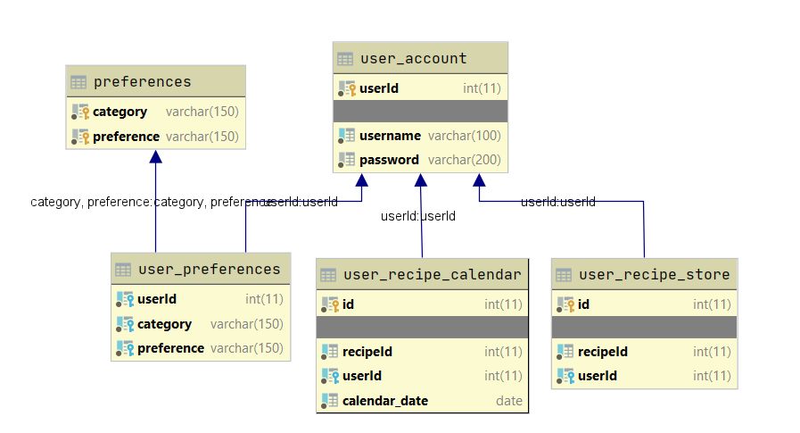

# Foodplanner RESTful API
## How to run locally:
1. Clone the repo to your local mashine;
2. Open terminal in project's directory;
3. Call `npm install` in terminal;
4. Create `.env` file in project's parent dir;
5. Insert your API key to the end after ' ': `API_KEYS='old-api-keys your-new-api-key'` and your secret token: `TOKEN_SECRET='your-secret-token'`;
6. If testing locally, create local MySQL database (read below);
7. Check database connection credencials: [connection/db.js](/connections/db.js);
7. Call `npm start` in terminal to run the server
(If having issues with reading API_KEY from .env file, call `npm install dotenv` and re-run the server).
8. When sending token in Authorization header, don't forget to add prefix `Bearer ` to it!
## Endpoints:
### GET
1. Get random recipe(s): `/recipes/random`. Query params: `number` - number of results from 0 to 100 (optional, by def. 1); `tags` - comma-separated search tags (optional): `/recipes/random?number=5&tags=vegetarian,dessert`;
2. Search recipe(s): `/recipes/search`. Query params: `query` - search query string; `number` - number of results to return (optional); `cuisine` - comma-separated cuisines (optional); `diet` - comma-separated diets (optional); `intolerances` - comma-separated intolerances (optional); [List of supported diets, cuisines and intolerances](cuisines-diets-intolerances-csv.txt);
3. Get recipe by id: `/recipes/{id}`;
4. Check user's authentication: `/users/auth` with header: `"Authorization": "Bearer your-secret-token"`. Returns `200(OK)` with JSON-body: `{ "username" : "your-username" }` or `401(Unauthorized)`. Used to check if the user is logged in already.
5. Get saved recipes for current user: `/saved` with header: `Authorization: Bearer your-secret-token`. Returns full recipe-data array in JSON: `[ {...} ]`.
6. Get saved to calendar recipes for current user: `/calendar`  with header: `Authozisation: Bearer your-secret-token`. Returns JSON-body in format: `[ { "recipe": {...}, "date": "yyyy-MM-dd" } ]`. Sorted by date;
7. Get saved user preferences (diets, intolerances and cuisines): `/preferences` with header: `Authozisation: Bearer your-secret-token`. Returns `200(OK)` and JSON-body in format: `{ "intolerances" : [ "Gluten", "Peanut" ], "cuisine" : [ "German" ] }`. Category can be missing, if there are no preferences of it saved. Can return `401` if not authorized.
### POST
1. Login user: `/users/login` with JSON-body in format: `{ "username": "your-username", "password": "your-password-md5-hash" }`. Returns status `200(OK)` with JSON-body `{ "username" : "your-username", "token" : "your-secret-token" }`, or `404 (Not found)`;
2. Register user: `/users/register` with JSON-body in format: `{ "username": "your-username", "password": "your-password-md5-hash" }`. Returns status `200(OK)` with JSON-body `{ "username" : "your-username", "token" : "your-secret-token" }`, or `409(Conflict)` if username already exists. Returns `200(OK)` or `500` if there is a db error (e.g. duplicate);
3. Save recipe for current user: `/saved` with header: `"Authorization": "Bearer your-secret-token"` and JSON-body in format: `{ "recipeId": 664087 }`. Returns `200(OK)` or `400` with message if request body is wrong or `401(Unathorized)` if token is wrong or illegal, or `500` if there is a db error (e.g. duplicate);
4. Save recipe to calendar for the current user:  `/calendar` with header: `"Authorization": "Bearer your-secret-token"`
and JSON-body in format: `{ "recipeId" : 715383, "date" : "yyyy-MM-dd" }`. Returns `200(OK)` or `400` with message if request body is wrong or `401(Unathorized)` if token is wrong or illegal, or `500` if there is a db insertion error.
5. Save new preferences for current user: `/preferences` with header: `Authozisation: Bearer your-secret-token` and JSON-body in format: `{ "intolerances" : [ "Gluten", "Peanut" ], "cuisine" : [ "German" ] }`. Important! : in order to simplify the process of saving preferences, only the structure of sent body is checked (not empty, all properties contain not empty arrays: otherwise return `400(Bad Request)`). Semantically the body won't be checked, and no errors will be thrown. If you try to save already saved preference, it won't cause a conflict. "New" preferences, that are semantically right, will be saved. Also, adding new preferences doesn't replace the old ones. Already added will remain in database, complemented by new ones. To replace all saved preferences with new ones, passed in body, use PUT method (find below). 
### PUT
1. Replace already saved user preferences with new ones: `/preferences` with header: `Authozisation: Bearer your-secret-token` and JSON-body in format: `{ "intolerances" : [ "Gluten", "Peanut" ], "cuisine" : [ "German" ] }`. All previously saved preferences for current user will be firstly deleted and then new ones from body will be saved. The saving mechanism is the same as in POST method (find above). 
### PATCH
1. Update date of saved to calendar recipe for current user: `/calendar` with header: `"Authorization": "Bearer your-secret-token"` and JSON-body in format: `{ "recipeId" : 715383, "date" : yyyy-MM-dd", "newDate" : "yyyy-MM-dd" }`. Returns `200(OK)` or `400` with message if request body is wrong, or `401(Unathorized)` if token is wrong or illegal, or `500` if there is a db update error.
### DELETE
1. Delete saved to calendar recipe for current user: `/calendar` with header: `"Authorization": "Bearer your-secret-token"` and JSON-body in format: `{ "recipeId" : 715383, "date" : "yyyy-MM-dd" }`. Returns `200(OK)` or `400` with message if request body is wrong, or `401(Unathorized)` if token is wrong or illegal, or `500` if there is a db deletion error.
2. Delete saved recipe for current user: `/saved` with header: `"Authorization": "Bearer your-secret-token"` and JSON-body in format: `{ "recipeId" : 715383 }`. Returns `200(OK)` or `400` with message if request body is wrong or nothing was deleted (e.g. not found), or `401(Unathorized)` if token is wrong or illegal, or `500` if there is a db deletion error.
3. Delete user: `/users` with header: `"Authorization": "Bearer your-secret-token"` and password MD5 hash in JSON-body: `{ "password" : "your-password-md5-hash" }`. Returns `200(OK)` or `400` if password is wrong, or `500` if SQL error has occured.
4. Delete all saved preferences for current user: `/preferences` with header: `"Authorization": "Bearer your-secret-token"`.  Returns `200(OK)` or `401(Unathorized)` if token is wrong or illegal, or `500` if there is a db deletion error.
## Database:

### Remote (preferable!)
Heroku add-on [ClearDB](https://devcenter.heroku.com/articles/cleardb) is used. Accessible on Heroku dashboard. ClearDB breaks persistent connections, so we are using connection pool. No error will be thrown in case if there is no free connections right now, the request will be enqueued (small delay is possible).
### Locally (use only in special cases, may cause more problems!):
1. Install MySQL Server (and some tool with interface to work with DB: MySQL Workbench, DataGrip, DBeaver);
2. Create local database with the name `recipe_planner_db` and run there [these SQL statements](recipe_planner_db.sql). This will create a DB scheme and add a default user in `user_accout` table for early login testing;
3. Database connection in server project is encapsulated in [connection/db.js](/connection/db.js). In other modules just call a global variable `db`. Check connection credencials before running (use your local credencials if running locally, otherwise use Heroku ClearDB credencials);
## Error codes:
1. `200` - OK
2. `400` - Bad request (usually with message, request body or query params are wrong)
2. `401` - Unauthorized (token missing or illegal)
3. `404` - Not found (usually when url is wrong)
4. `409` - Conflict (usually when trying to register already registered user)
5. `500` - Internal Server Error (usually SQL or external API, e.g. FK constraint failed, or Spoonacular API request failed)
## Deployment:
[Heroku App](https://recipe-planner-app.herokuapp.com/)
## API documentation:
[Postman](https://documenter.getpostman.com/view/5782940/SzzdBzzN?version=latest)
## 3-rd party API:
 [Spoonacular API](https://spoonacular.com/food-api/)
  - [Supported tags (cuisines, diets, intolerances)](cuisines-diets-intolerances-csv.txt) - can be used with `/random`, `/search` and `/preferences` endpoints.
  
